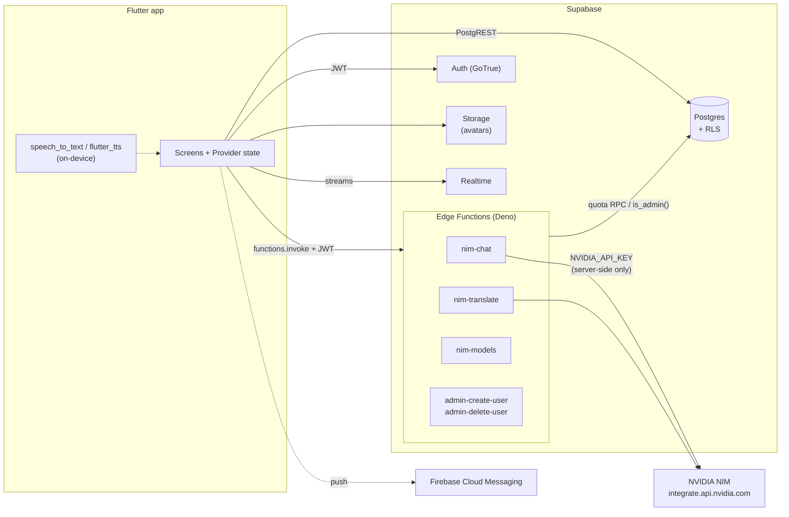
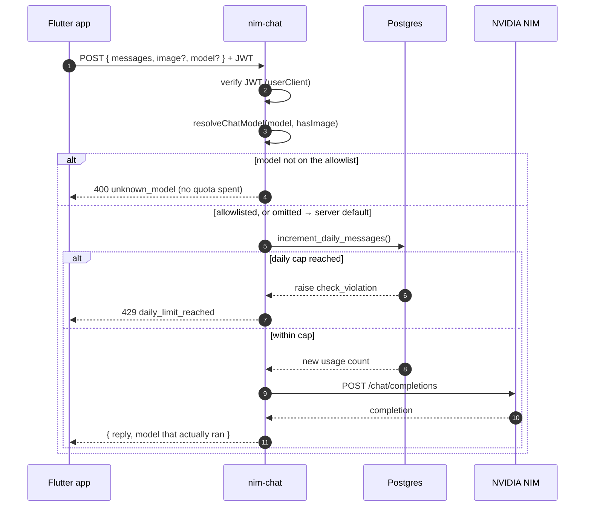
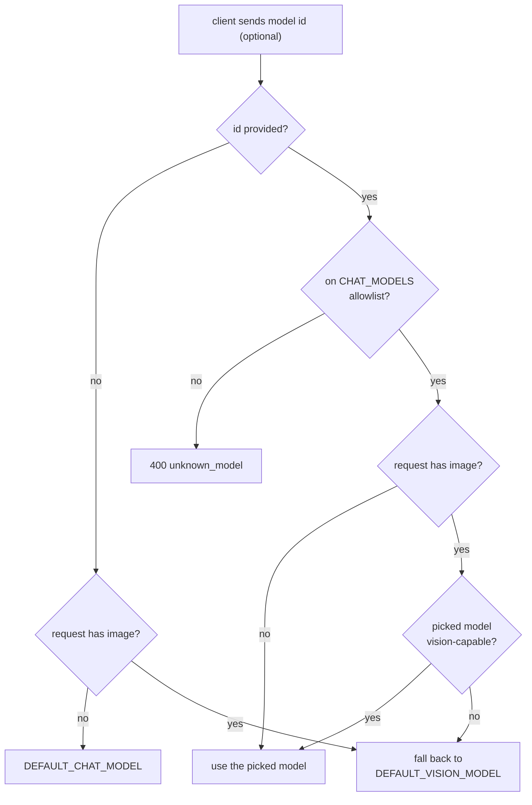
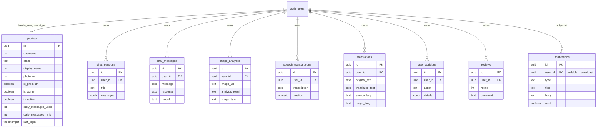
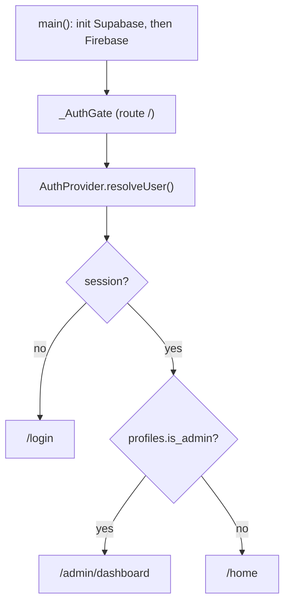

# SmartAI

A cross-platform AI assistant — Flutter frontend, **Supabase** backend (Postgres + Auth + Storage + Realtime), and **NVIDIA NIM** for the models. Ships with a full admin panel backed by real analytics.

Targets Android, iOS, web, macOS, Linux and Windows from one codebase.

## Features

**User app**
- Email/password auth plus Google and GitHub OAuth, with OTP password reset
- AI chat with conversation history and a user-selectable model
- Image understanding (vision) — attach an image and the request is routed to a vision model
- Speech-to-text and text-to-speech, running **on-device**
- Per-user daily usage limits, premium tier, profile with avatar upload
- 8 locales: en, fr, ar, de, es, tr, ru, zh

**Admin panel**
- Real-time dashboard: KPIs with month-over-month deltas, 14-day activity trend, AI-service usage, user growth, top users, recent reviews and activity
- User management, chat logs, notifications, reviews
- CSV report exports (users, AI usage, reviews, activity log)

## Architecture



Three properties worth calling out:

- **No API keys on the client.** Every AI call goes through an Edge Function holding `NVIDIA_API_KEY` server-side. The client never sees it.
- **The quota is enforced server-side.** `nim-chat` and `nim-translate` both call the `increment_daily_messages()` Postgres function before reaching NVIDIA, so the cap can't be bypassed by a modified client.
- **Firebase is only push.** Auth, database, storage and realtime are entirely Supabase; `firebase_core` + `firebase_messaging` remain solely for FCM.

### How an AI request flows



The model is resolved *before* quota is spent, so a bad model id never costs the user a message. An image in the request always resolves to a vision-capable model regardless of what was picked, and the response echoes the model that actually ran.

### Model selection

Model ids are **not** hardcoded in the app. `supabase/functions/_shared/nvidia.ts` owns the allowlist, and `nim-models` serves it to the client, so retiring or adding a model is a function deploy rather than an app-store release.



Because the server re-validates every pick, a client can't bill an arbitrary or unapproved model to the API key.

> **NVIDIA retires models, and a dead id takes the app down.** A retired model returns HTTP 410 on every call. Two traps when choosing a replacement:
> 1. The public catalog (`curl https://integrate.api.nvidia.com/v1/models`, no auth) lists far more models than a given account can actually call — most return 404 `Not found for account`. **Probe a candidate with a real request before adding it.**
> 2. The Nemotron models are reasoning-capable; a tight `max_tokens` can return raw chain-of-thought instead of an answer. The 1024 default is fine.

## Data model

Every table has RLS enabled and is owner-scoped by `auth.uid() = user_id`. Admins read across users via the `is_admin()` SECURITY DEFINER helper.



A `handle_new_user` trigger provisions the `profiles` row on signup, and `protect_privileged_profile_fields` stops a non-admin escalating their own `is_admin` / `is_premium` / limit columns.

## Startup and routing



## Tech stack

| Layer | Tech |
|---|---|
| App | Flutter (Dart), Provider, fl_chart, google_fonts |
| Backend | Supabase — Postgres, GoTrue, Storage, Realtime, Edge Functions (Deno) |
| AI | NVIDIA NIM — chat `nvidia/nemotron-3.*` / `openai/gpt-oss-*`, vision `meta/llama-3.2-*-vision` |
| Speech | `speech_to_text` + `flutter_tts` (on-device) |
| Push | Firebase Cloud Messaging |
| Toolchain | Nix flake dev shell (`frontend/flake.nix`) |

## Repository layout

```
frontend/                  Flutter app
  lib/
    core/                  Supabase config + global client
    models/                data models (snake_case ↔ Dart mapping)
    providers/             Provider state: auth, theme, language
    services/              auth, data (PostgREST/Realtime), AI (Edge Functions)
    screens/               user/ and admin/ screens
    l10n/                  hand-rolled localization, 8 locales
    theme/                 D.* dark-mode colour helpers
  flake.nix                Nix dev shell (Flutter, JDK17, Android SDK, CocoaPods)
supabase/
  migrations/              schema, RLS policies, RPCs
  functions/
    _shared/               CORS, NVIDIA config + model allowlist, client factories
    nim-chat/              chat + vision
    nim-translate/         translation
    nim-models/            serves the model allowlist
    admin-*/               privileged user create/delete (service role)
```

## Getting started

### Which backend does the app talk to?

`frontend/lib/core/supabase_config.dart` is committed pointing at the **hosted** Supabase project. To develop against a local stack instead, swap `url` and `publishableKey` there for the values `supabase status` prints — and remember that Android emulators need `10.0.2.2`, not `127.0.0.1`.

### 1. Toolchain

```bash
cd frontend
nix develop        # Flutter SDK, JDK17, Android SDK, CocoaPods
```

The flake is the supported toolchain and carries two non-obvious workarounds: it uses `mkShellNoCC` so the Nix cc-wrapper can't shadow Apple's clang/ld for Xcode builds, and it materializes a writable copy of the Flutter SDK at `frontend/.flutter-sdk` because Gradle and Xcode both need to write into the SDK.

### 2. Local Supabase (optional)

The stack runs in containers. On macOS with rootless **Podman**, containers need a network whose DNS forwards externally, or the Edge Functions can't reach NVIDIA:

```bash
podman network create --dns 8.8.8.8 --dns 1.1.1.1 smartai_net
export DOCKER_HOST="unix://$(podman machine inspect --format '{{.ConnectionInfo.PodmanSocket.Path}}')"

supabase start --network-id smartai_net
supabase functions serve --network-id smartai_net --env-file supabase/functions/.env
```

`functions serve` recreates the edge-runtime container, so it needs `--network-id` too or it drops back onto the non-forwarding default network. Docker Desktop and Colima also work; the DNS step is a Podman-rootless workaround.

### 3. NVIDIA key

Create `supabase/functions/.env` (gitignored) with a key from [build.nvidia.com](https://build.nvidia.com/settings/api-keys):

```bash
NVIDIA_API_KEY=nvapi-...
# Optional overrides; defaults live in functions/_shared/nvidia.ts.
# Setting these shadows the code defaults — use them as an emergency lever
# when a model is retired, not as permanent config.
# NIM_CHAT_MODEL=nvidia/nemotron-3.5-lightning-30b-a3b
# NIM_VISION_MODEL=meta/llama-3.2-90b-vision-instruct
```

### 4. Run

```bash
cd frontend
flutter pub get
flutter run                 # or -d macos / -d chrome / -d android
```

To make someone an admin, set `is_admin = true` on their `profiles` row.

## Common commands

```bash
# app (from frontend/)
flutter analyze
flutter test                                  # or: flutter test test/widget_test.dart
flutter build macos --debug

# database (from repo root)
supabase migration new <name>
supabase db reset --network-id smartai_net    # replays migrations locally

# edge functions
supabase functions deploy nim-chat nim-translate nim-models
supabase secrets list
```

## Gotchas

- **Speech is on-device.** There are no ASR/TTS Edge Functions and no server-side speech models. The `speech_transcriptions` table records on-device results.
- **Translation has no UI yet.** `nim-translate` is deployed and quota-enforced, but `AiService.translate()` currently has no call site in `lib/screens/**` — the endpoint is only reachable directly.
- **`supabase db reset` hangs** on the post-apply restart under Podman even though the migration commits; kill it once the tables exist. To run raw SQL locally, `podman exec -i supabase_db_SmartAi psql -U postgres -c "<sql>"`.
- **`[analytics] enabled = false`** in `config.toml` — analytics/vector hang `supabase start` under Podman.
- **macOS entitlements** need network-client (Supabase/NVIDIA), audio-input (on-device speech), and user-selected file read-write (avatar upload, CSV export). New native capabilities require editing both `macos/Runner/*.entitlements` files plus a full rebuild.
- **Adding a UI string** means adding the key to **all 8** locale maps in `lib/l10n/app_localizations.dart`.
